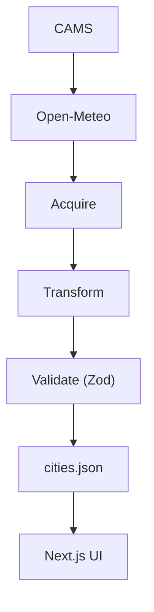

# UrbanPulse

**A public-data enhancement layer for city dashboards.**

UrbanPulse extends existing city intelligence dashboards with environmental visibility—surfacing PM2.5 exposure, trend direction, and rank adjustments that augment baseline livability rankings. It sits alongside the dashboards and rankings you already use, helping decision makers spot where headline scores and hidden environmental risk diverge.

Built for citizens comparing relocation options and municipal staff screening cities where livability rankings omit air-quality context.

---

## The problem

City dashboards and livability rankings help compare metros on infrastructure, safety, and services. They rarely surface whether the air meets health guidelines—or whether conditions are getting worse. A city ranked #8 and one ranked #12 can look interchangeable on a dashboard; one may sit above the WHO PM2.5 target year-round while the other posts a worsening quarterly trend. Without exposure data, that gap stays invisible.

UrbanPulse adds an environmental visibility layer on top of those existing rankings. It does not replace official monitoring, regulatory reporting, or the dashboards you already rely on. It gives a consistent, reproducible view across 24 global cities so you can ask better questions before diving into local sources.

---

## What the prototype does

Four views on a single page—no login, no backend, no black-box commentary. Each view augments standard city-dashboard comparisons with environmental context.

| View | What it answers |
|------|-----------------|
| **Overview** | How is the cohort doing? Which cities shift rank after exposure is factored in? |
| **Compare** | How does baseline livability rank differ from environment-adjusted effective rank? |
| **Trends** | Is PM2.5 improving, stable, or worsening? Monthly series against WHO reference lines. |
| **Map** | Where are elevated-exposure cities geographically? |

Rule-based insight cards explain *why* a city appears in a given state—trend thresholds, WHO bands, rank penalties—with the logic shown in plain text.

### Effective Rank (exploratory metric)

**Effective Rank** is an exploratory comparison metric—not an official ranking. It exists solely to visualize how environmental exposure might shift a city's position relative to its baseline livability rank. Penalties are intentionally simple and deterministic; the full logic is transparent and reproducible in [`docs/METHODOLOGY.md`](docs/METHODOLOGY.md).

> Users should treat Effective Rank as a screening tool rather than a formal city ranking methodology.

---

## Why this dataset

The dynamic dataset is **hourly PM2.5** from the [Copernicus Atmosphere Monitoring Service (CAMS)](https://atmosphere.copernicus.eu/), acquired through the free [Open-Meteo Air Quality API](https://open-meteo.com/en/docs/air-quality-api).

We chose it because:

- **Institutional source.** CAMS is the EU's operational atmospheric composition service (ECMWF), not a scraped or commercial feed.
- **Global consistency.** One model at city coordinates worldwide—no stitching national APIs with incompatible methods.
- **Decision relevance.** PM2.5 is the WHO's primary urban air health indicator, with published 2021 guideline bands.
- **Reproducibility.** Parameterised HTTP requests, no API keys, no credentials that expire.

**Important limitation:** CAMS values at a lat/lon point are modelled concentrations, not readings from a municipal monitor. They support cross-city comparison and trend screening—not regulatory compliance or block-level exposure.

A static **livability baseline** (rank and score per city) is compiled once from public indicator bands and stored in the city registry. It is not co-fetched with air quality, so the environmental pipeline stays auditable as a single dynamic source.

Full source documentation: [`docs/DATA_SOURCE.md`](docs/DATA_SOURCE.md)

---

## Data integrity

Every city record in the app passes through the same path:

```
CAMS (via Open-Meteo) → acquire → clean → aggregate → validate → render
```



Institutional PM2.5 data flows from CAMS through ingestion, schema validation, and static export before the Next.js app renders it.

- **Acquire:** Hourly `pm2_5` per city centroid from `scripts/config/cities_registry.json`
- **Clean:** UTC timestamps, duplicate hours averaged, sanity ceiling at 500 µg/m³, no imputation
- **Gate:** Cities below 50% observation coverage are excluded entirely
- **Derive:** WHO exposure bands, 3-month trend %, effective rank adjustment
- **Validate:** Zod schema (`src/lib/schema.ts`) on every load; invalid data blocks the UI with a clear error

Quality metrics are written to `public/data/data_quality.json` and `docs/DATA_QUALITY.md` on each build.

Methodology detail: [`docs/METHODOLOGY.md`](docs/METHODOLOGY.md)

---

## Quick start

**Prerequisites:** Node.js 20+, Python 3.11+

```bash
git clone https://github.com/HarshYadav1711/UrbanPulse.git
cd UrbanPulse
npm install
npm run dev
```

Open [http://localhost:3000](http://localhost:3000).

The app ships with a pre-built dataset. To refresh from CAMS:

```bash
npm run data:fetch
```

This runs `scripts/ingest/build.py`, fetches the latest 365 days of hourly PM2.5, and regenerates `public/data/cities.json`.

---

## Tech stack

- **Next.js 15** (App Router), React 19, Tailwind CSS 4
- **Recharts** for trend charts, **Leaflet** for the exposure map
- **Zod** for the data contract
- **Python** ingestion pipeline (`scripts/ingest/`)

---

## Project structure

```
UrbanPulse/
├── docs/
│   ├── ARCHITECTURE.md      # Data model, screens, folder map
│   ├── DATA_SOURCE.md       # Acquisition and licensing
│   ├── DATA_QUALITY.md      # Auto-generated quality report
│   └── METHODOLOGY.md       # Cleaning and transformation notes
├── public/data/
│   └── cities.json          # App dataset (validated on load)
├── scripts/
│   ├── config/cities_registry.json
│   └── ingest/              # acquire · transform · build
└── src/
    ├── lib/                 # schema, cities loader, insights, status rules
    └── components/          # overview, compare, trends, map panels
```

---

## Who this is for

**Citizens** comparing cities get an enhancement layer on top of livability dashboards—exposure bands, recent trend direction, and rank shifts that baseline scores alone do not surface.

**Municipal staff and decision makers** get a screening layer alongside existing city intelligence: which high-ranked cities carry elevated PM2.5, which regions run above cohort average, where quarterly trends need attention. The insight rules are transparent—useful for briefing, not a substitute for local monitor networks.

---

## Why this matters

- **Hidden risk detection.** Surfaces high-ranked cities with elevated PM2.5—places where headline livability scores and environmental exposure diverge.
- **Trend awareness.** Flags worsening PM2.5 trajectories even when baseline rankings remain strong.
- **Transparency.** Rule-based insight cards with explicit thresholds—no black-box scoring or opaque composite indices.
- **Reproducibility.** One public institutional source (Copernicus CAMS via Open-Meteo) and fully documented transformations from acquisition through validation.

---

## Submission

| Field | Value |
|-------|--------|
| **Prototype link** | [http://localhost:3000](http://localhost:3000) after `npm install && npm run dev` · Source: [github.com/HarshYadav1711/UrbanPulse](https://github.com/HarshYadav1711/UrbanPulse) |
| **Public dataset** | [Copernicus CAMS PM2.5](https://atmosphere.copernicus.eu/) via [Open-Meteo Air Quality API](https://open-meteo.com/en/docs/air-quality-api) (`pm2_5`, hourly, city centroid coordinates) |
| **Rationale (50 words)** | City livability dashboards rarely include air quality exposure. UrbanPulse is a public-data enhancement layer: Copernicus CAMS PM2.5 via Open-Meteo augments existing rankings with environmental visibility—free, globally consistent, institutionally maintained, tied to WHO thresholds—helping citizens and planners spot hidden environmental risk without replacing local dashboards or paid APIs. |
| **Cleaning / transformation** | Hourly PM2.5 fetched per city centroid (365-day window, UTC). Duplicates averaged; values above 500 µg/m³ discarded; cities under 50% coverage excluded; missing hours not imputed. Aggregated to daily and monthly means, 90-day rolling average, window mean, WHO 2021 bands, 3-month trend %, and effective livability rank adjustment. Exported to JSON/CSV with machine-readable quality report. |

---

## Licence and attribution

Air quality data: Copernicus CAMS via Open-Meteo (free non-commercial use; see [Open-Meteo terms](https://open-meteo.com/en/terms)).

UrbanPulse code: see repository licence.
